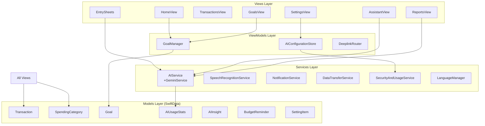
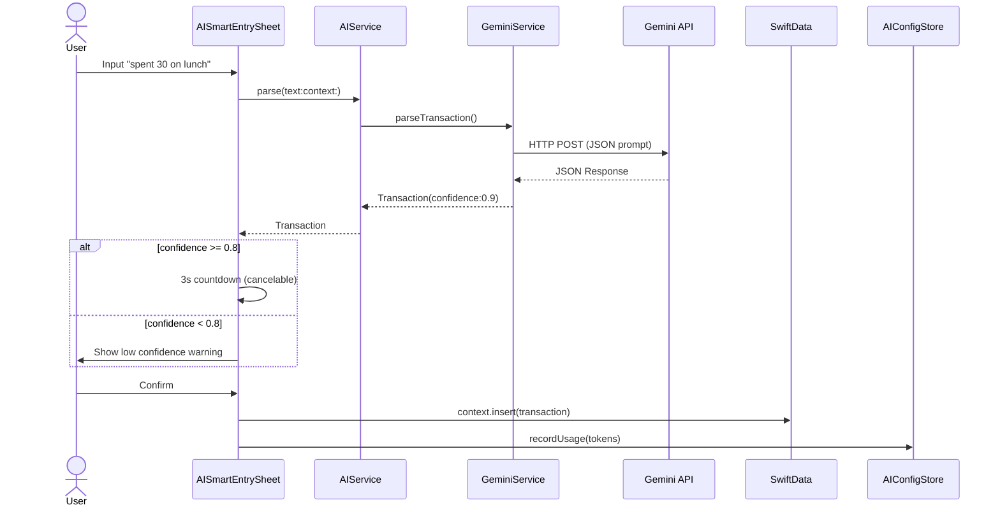

# CLAUDE.md

This file provides guidance to Claude Code (claude.ai/code) when working with code in this repository.

## Project Overview

**Moneywise** is a native iOS SwiftUI personal finance application that operates offline-first with AI-powered transaction entry using Google's Gemini API. The app uses SwiftData for local persistence and Keychain for secure API key storage.

**Key Technology Stack:**
- SwiftUI + SwiftData (iOS 18.6+, deployment target 17.4+)
- Google Gemini 2.5 Flash API
- Keychain Services for security
- SFSpeechRecognizer for voice input
- Charts framework for visualization

## Build and Run Commands

### Building the Project
```bash
# Navigate to the project directory (where .xcodeproj is located)
cd /Users/owenlee/Desktop/2025年/项目/moneywise

# Open in Xcode (recommended approach)
open Moneywise.xcodeproj

# Build from command line (requires full Xcode installation, not command line tools)
xcodebuild -project Moneywise.xcodeproj -scheme Moneywise -configuration Debug build
```

### Running Tests
```bash
# Note: Test targets exist but are empty/placeholder
# Tests can be run via Xcode (Cmd+U) or:
xcodebuild test -project Moneywise.xcodeproj -scheme Moneywise -destination 'platform=iOS Simulator,name=iPhone 15'
```

### Code Signing
- Bundle ID: `owenlee.Moneywise`
- The project requires an Apple Developer Team for running on physical devices
- In Xcode: Set your team in "Moneywise" target > Signing & Capabilities
- Simulator builds work without signing

## Architecture

### MVVM Pattern
The application follows Model-View-ViewModel architecture:

1. **Models** (`/Moneywise/Models/`)
   - `Transaction`: Core entity with AI confidence scoring
   - `SpendingCategory`: User categories with emoji icons (migrated from SF Symbols)
   - `Goal`: Savings targets with progress tracking
   - `AIUsageStats`: Token usage tracking
   - `AIInsight`: Cached AI-generated analysis
   - `BudgetReminder`: Notification schedules
   - `SettingItem`: App configuration storage

2. **Views** (`/Moneywise/Views/`)
   - Organized by feature: `Home/`, `Transactions/`, `Reports/`, `Goals/`, `Assistant/`, `Settings/`
   - `Shared/`: Reusable components (EntrySheets, CommonComponents, Formatters)
   - Navigation via `ContentView` TabView with 5 tabs (Home, Assistant, Transactions, Reports, Goals)
   - Settings accessed from Home toolbar (top-right)
   - FloatingButtonBar for quick entry actions

3. **ViewModels** (`/Moneywise/ViewModels/`)
   - `GoalManager`: Manages goals state and CRUD operations
   - `AIConfigurationStore`: Manages API key (Keychain) and usage stats
   - ViewModels are injected via SwiftUI Environment (`managedGoals`, `aiConfiguration`, `deeplinkRouter`)

4. **Services** (`/Moneywise/Services/`)
   - `AIService.swift`: Facade for AI operations (parse, analyze, chat). Contains `GeminiService` class internally for low-level API calls
   - `SpeechRecognitionService.swift`: SFSpeechRecognizer wrapper
   - `NotificationService.swift`: Local notification scheduling
   - `DataTransferService.swift`: CSV import/export with deduplication
   - `SecurityAndUsageService.swift`: Keychain wrapper
   - `LanguageManager.swift`: Localization support
   - `Prompt.swift`: Gemini prompt templates

### Dependency Injection
Dependencies are injected via SwiftUI Environment in `MoneywiseApp.swift:19-22`:
```swift
.environment(\.modelContext, persistenceController.container.mainContext)
.environment(\.managedGoals, GoalManager(...))
.environment(\.aiConfiguration, AIConfigurationStore(...))
.environment(\.deeplinkRouter, deeplinkRouter)
```

### Architecture Diagram



## Key Implementation Details

### SwiftData Setup
- `ModelContainer` configured in `MoneywiseApp.swift:39-48` for all models:
  - `Transaction`, `SpendingCategory`, `BudgetReminder`, `Goal`, `AIUsageStats`, `AIInsight`, `SettingItem`
- Bootstrap process (`MoneywiseApp.swift:55-71`) creates default categories on first launch
- Migration logic (`MoneywiseApp.swift:81-133`) converts legacy SF Symbol icons to emojis

### AI Entry Flow
1. User opens `AISmartEntrySheet` via floating brain button
2. Text input or voice input (via `SpeechRecognitionService`)
3. `AIService.parse()` calls Gemini 2.5 Flash with strict JSON prompt
4. Response displayed in `ConfirmationCard` with confidence score
5. If confidence ≥ 0.8: 3-second auto-confirm countdown (cancelable)
6. If confidence < 0.8: Warning shown, requires manual confirmation
7. Confirmed transaction inserted into SwiftData with token usage tracked



### Deep Linking
- URL scheme: `moneywise://`
- Routes: `moneywise://ai`, `moneywise://manual`, `moneywise://goal`, `moneywise://settings`
- Handled by `DeeplinkRouter` in `Models/DeeplinkRouter.swift`
- Route consumption in `ContentView.swift:73-92`

### Localization
- Currently supports English and Mandarin Chinese
- Uses `LanguageManager` for language-specific logic
- All UI strings should be localized

### Emoji Icons
Categories use emoji icons (not SF Symbols). The migration in `MoneywiseApp.swift:81-133` converted legacy SF Symbol names to emojis.

## Common Development Patterns

### Creating New Views
- Follow the existing folder structure under `/Moneywise/Views/`
- Use `@Environment(\.modelContext)` to access SwiftData
- For state management, use `@Observable` ViewModels or `@State` for simple UI state
- Access injected ViewModels via `@Environment(\.managedGoals)` etc.

### Adding New Models
1. Add `@Model` class in `/Moneywise/Models/FinanceModels.swift` or separate file
2. Register in `ModelContainer` configuration (`MoneywiseApp.swift:39-47`)
3. Run app once to create/migrate database tables
4. If needed, add migration logic in `bootstrap()` method

### Working with AI Services
- Use `AIService` (not `GeminiService` directly) for business logic
- `AIService` is initialized with an `apiKeyProvider` closure for dependency injection
- Prompts are defined in `Prompt.swift` - follow the strict deterministic format
- Always record token usage via `AIConfigurationStore.recordUsage(input:output:)`
- Handle `AIServiceError` cases appropriately (missingAPIKey, invalidAPIKey, networkError, etc.)

### GeminiService Proxy Configuration
- `GeminiService` class (defined inside `AIService.swift`) has a hardcoded proxy configuration (127.0.0.1:50960) at lines 114-121
- This may need adjustment for different network environments

### Development Conventions
- **SwiftUI:** Use declarative syntax and `@Environment` for dependency injection
- **SwiftData:** Use `@Model` for persistent classes and `ModelContext` for CRUD operations
- **State Management:** Use `@Observable` for ViewModels (new iOS 17+ observation system)
- **Localization:** Support for English and Simplified Chinese via `LanguageManager`

### Saving Data
```swift
// For SwiftData models
context.insert(modelInstance)
try context.save()

// For GoalManager (auto-reloads)
goalManager.addGoal(newGoal)

// For AI Configuration
aiConfiguration.recordUsage(input: 100, output: 50)
```

## Important Files

- `MoneywiseApp.swift`: App entry, SwiftData setup, dependency injection, bootstrapping
- `ContentView.swift`: Main navigation, TabView with 5 tabs, deep link handling
- `Models/FinanceModels.swift`: All SwiftData `@Model` definitions
- `Models/EnvironmentValues+Extensions.swift`: Environment key definitions for DI
- `Models/ModelContext+Helpers.swift`: Helper extensions for category lookup and usage stats
- `Models/DeeplinkRouter.swift`: URL routing (`moneywise://` scheme)
- `Services/AIService.swift`: Primary AI interface; contains `GeminiService` class internally
- `Services/Prompt.swift`: AI prompt templates
- `Views/Shared/EntrySheets.swift`: Manual and AI entry forms
- `ViewModels/AppViewModels.swift`: `GoalManager` and `AIConfigurationStore` implementations
- `ARCHITECTURE.md`: Detailed architecture documentation

## Security Considerations

- Gemini API Key stored in Keychain via `SecurityAndUsageService`
- Never commit API keys to git
- All data stored locally in app sandbox (SwiftData SQLite)
- No cloud sync or external data transmission except Gemini API calls
- **Note**: `GeminiService` class (in AIService.swift) has a hardcoded proxy configuration that may affect network routing
