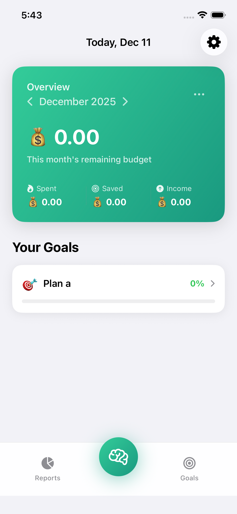
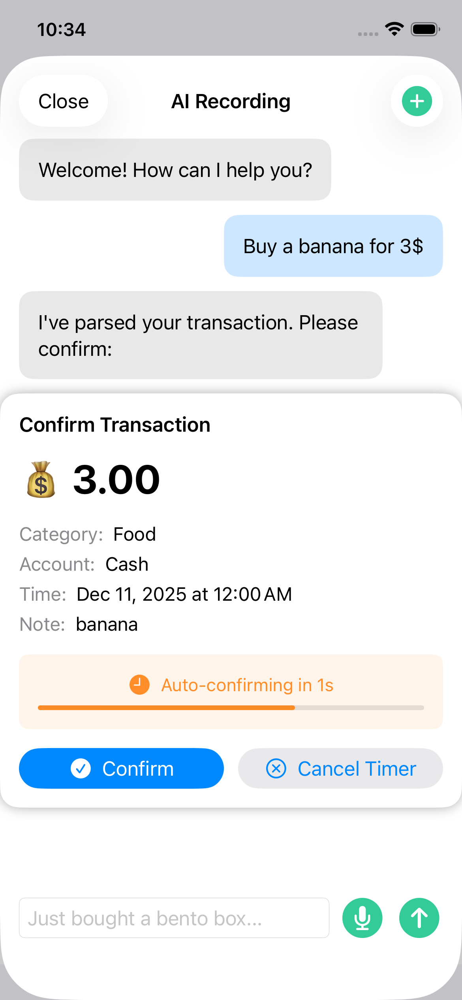

# Moneywise

A native iOS personal finance app that keeps your data local and uses AI to make transaction entry frictionless.

No accounts. No forced cloud sync. Just your financial data, on your phone.

## Features

- **AI-Powered Entry** - Type or speak "spent $30 on lunch" and let AI extract amount, category, date, and payment method
- **Smart Confirmation** - High-confidence entries auto-confirm after 3 seconds; low-confidence ones wait for review
- **Spending Analytics** - Visual charts showing spending trends by category and time period
- **Savings Goals** - Set goals with targets and track progress with visual indicators
- **Budget Management** - Set category budgets with progress tracking and alerts
- **Recurring Transactions** - Schedule repeat transactions (daily, weekly, monthly, yearly)
- **Data Privacy** - Everything stored locally in SwiftData; API key secured in Keychain
- **CSV Import/Export** - Backup or migrate your data
- **Multi-language** - English and Simplified Chinese support
- **Dark Mode** - Full dark theme support

## Screenshots

<div align="center">
  
  
</div>

## How it works

Moneywise runs entirely on your device. Transactions are stored in SwiftData (SQLite), and your API key never leaves the Keychain.

The AI features use Google's Gemini 2.5 Flash to parse natural language input. The app supports CloudKit sync for multi-device backup (optional).

## Requirements

- **Xcode 16+** with iOS 18 SDK
- **iOS 17.4+** deployment target
- **Gemini API key** from [Google AI Studio](https://aistudio.google.com/app/apikey) (free tier available)

## Getting Started

```bash
git clone <repo-url>
cd Moneywise
open Moneywise.xcodeproj
```

1. Build and run (⌘R)
2. On first launch, default categories are created automatically
3. Navigate to Settings → AI Settings to add your Gemini API key
4. Start logging transactions by typing or speaking!

## Architecture

The app follows **MVVM** pattern with SwiftUI:

```
Views → ViewModels → Services → SwiftData
```

### Directory Structure

```
Moneywise/
├── Models/              # SwiftData @Model definitions
├── Views/
│   ├── Home/           # Dashboard, recent transactions
│   ├── Assistant/      # AI chat interface
│   ├── Transactions/   # Transaction list with search/filter
│   ├── Reports/        # Charts and insights
│   ├── Goals/          # Savings goals management
│   ├── Settings/       # App configuration
│   ├── Shared/         # Reusable components
│   └── AIEntry/        # AI input sheet
├── ViewModels/         # Business logic state management
├── Services/
│   ├── AI/             # Specialized AI services
│   ├── Background/     # Task scheduling
│   └── ...
└── Resources/          # Localizable strings, assets
```

### Key Components

- **`MoneywiseApp.swift`** — App entry, SwiftData container setup, dependency injection
- **`Services/AI/`** — Modular AI services (parsing, chat, analytics)
- **`Models/FinanceModels.swift`** — Transaction, Category, Goal, Budget models
- **`ViewModels/AppViewModels.swift`** — GoalManager, AIConfigurationStore

See [`CLAUDE.md`](CLAUDE.md) for detailed development guidance.

## Development Notes

### AI Service Architecture

The AI functionality is split into specialized services:

- **`GeminiService`** — Low-level HTTP communication with Gemini API
- **`TransactionParsingService`** — Converts natural language to transactions
- **`ChatAIService`** — Manages AI chat conversations
- **`AnalyticsAIService`** — Generates spending insights

### Security

- Gemini API key stored in Keychain (`SecurityAndUsageService`)
- All data stored locally in app sandbox
- Optional CloudKit sync for backup (user-controlled)
- No third-party analytics

### Proxy Configuration

`GeminiService` has a hardcoded proxy for development (127.0.0.1:50960). Configure via Settings if needed.

## Building from Command Line

```bash
# Build
xcodebuild -project Moneywise.xcodeproj -scheme Moneywise build

# Run tests
xcodebuild test -project Moneywise.xcodeproj -scheme Moneywise -destination 'platform=iOS Simulator,name=iPhone 15'

# Archive for release
xcodebuild archive -project Moneywise.xcodeproj -scheme Moneywise -archivePath Moneywise.xcarchive
```

For physical devices, set your development team in Target > Signing & Capabilities.

## Troubleshooting

| Problem | Solution |
|---------|----------|
| Build fails | Install Xcode 16+ with iOS 18 SDK |
| API key won't save | Check Keychain access; device might be locked |
| Voice input broken | Verify microphone permissions in iOS Settings |
| AI parsing fails | Test connection in Settings; check your API quota |
| Background tasks not running | Enable Background App Refresh in iOS Settings |

## Contributing

This project uses Claude Code for development. See `CLAUDE.md` for project-specific guidance.

## License

Copyright © 2025 Owen Lee. All rights reserved.

---

Developed with ❤️ using SwiftUI and Gemini AI.
