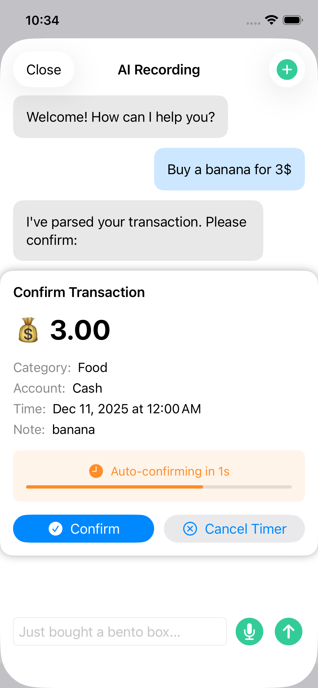
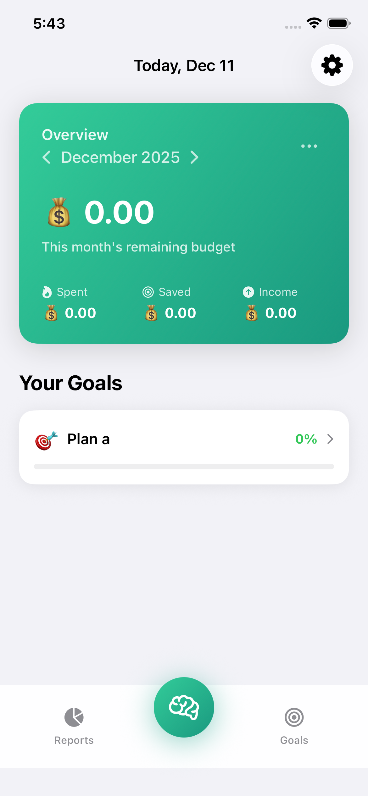

# Moneywise · AI-based Budgeting App🔐

> **A learner vibe coding project** 🚀
> Moneywise was developed with **Antigravity**

**Moneywise** is a native iOS SwiftUI application designed for **privacy and speed**. It operates **offline‑first** with no registration required, securing your data locally on your device while leveraging the power of **Google's Gemini API** for intelligent features. 🛡️

## Prototypes📱✨



## Core Features ✨

- ✅ **AI‑Powered Entry** 🤖: Effortlessly log transactions via text or voice, intelligently parsed by the Gemini 2.5 Flash model.
- ✅ **Voice‑to‑Text** 🎤: Real‑time English voice recognition for hands‑free logging.
- ✅ **Smart Auto‑Confirm** ⏱️: High‑confidence entries are automatically saved after a 3‑second countdown, streamlining your workflow.
- ✅ **Secure Local Storage** 🔐: Built with SwiftData and Keychain to ensure your financial data stays private.
- ✅ **CSV Import/Export** 📂: Full control over your data with easy migration tools.
- ✅ **Smart Reminders** ⏰: Stay on track with daily logging prompts and goal deadline alerts.
- ✅ **AI Financial Assistant** 💡: Get personalized insights and answers about your spending habits through a conversational interface.
- ✅ **Aesthetic Design** 🎨: Clean interface featuring coin emojis 💰 and smooth animations.

## Requirements 📋

- **Xcode 16** / **iOS 18 SDK** (Minimum iOS 17.4 for SwiftData & Charts support)
- **Swift 5.10**
- **Gemini API Key** (Get one for free and enter it in Settings)

## Getting Started 🚀

1. Open the project:
   ```bash
   open Moneywise.xcodeproj
   ```
2. Build and run in Simulator or on a device.
3. Upon first launch, default categories are automatically created.
4. To enable AI features, go to **Settings**, paste your API Key, and tap "Test Connection".

## What You Can Do 🎯

- 📊 **Track Spending** – quickly log expenses by typing or speaking.
- 🎯 **Set Savings Goals** – define targets and watch your progress.
- 🤖 **AI Insights** – ask the assistant for spending tips and summaries.
- 📁 **Import/Export CSV** – back up or move your data easily.
- ⏰ **Smart Reminders** – get daily prompts to keep your budget on track.
- 🔒 **Secure & Private** – all data stays on your device, encrypted with Keychain.


## Technical Details (Brief) 🛠️

- Built with **SwiftUI**, **SwiftData**, and **Keychain**.
- Powered by **Google Gemini 2.5 Flash** for AI parsing.
- Fully offline‑first, no cloud storage required.

---

For architectural details, please refer to [`ARCHITECTURE.md`](ARCHITECTURE.md).